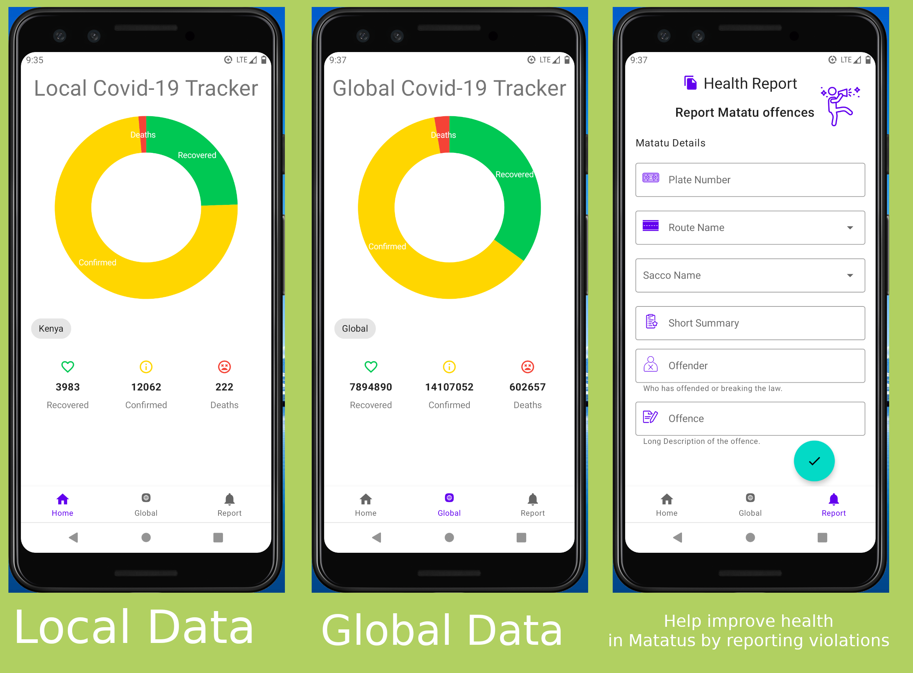

# Health-Report-App
  

This a health report app that aims to inform Matatu users and help improve health in matatus.

The app displays local data of covid-19 statistics and global data.

Health related cases reported through this app are uploaded on the cloud, and reports are generated and sent to the right authority.

Set Up.
------

The app fetches data from [https://covid19.mathdro.id/](https://covid19.mathdro.id/).

Reported cases are uploaded to Firebase Firestore databases, and reports are generated through firebase cloud functions.
